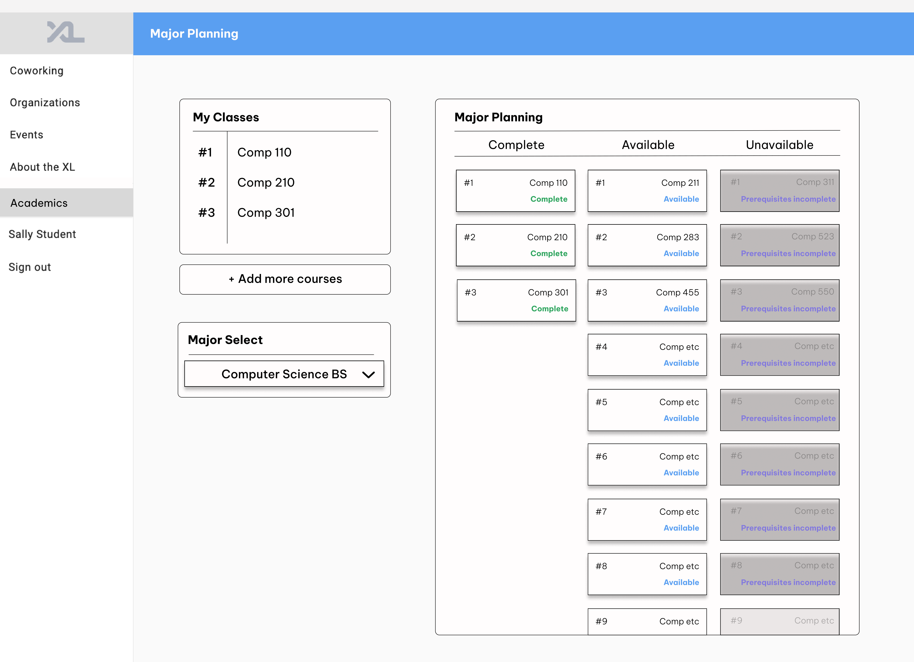
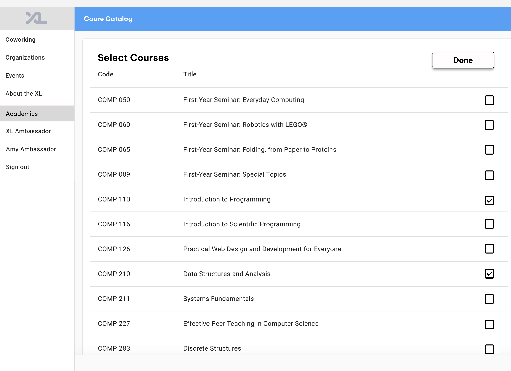
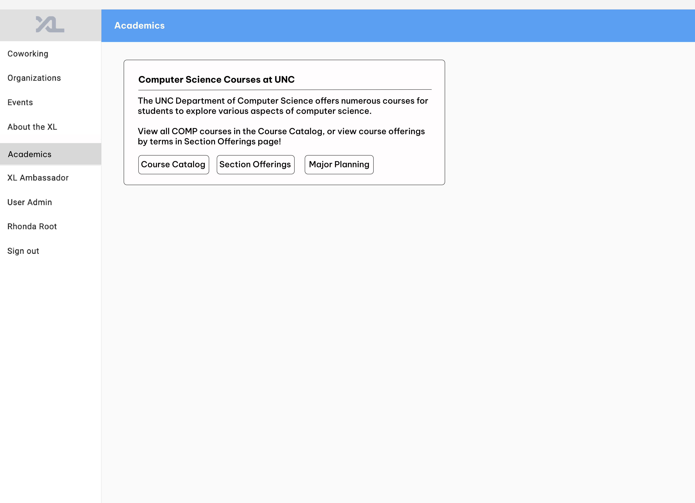

# Title: Major Planner

Aristotle Bernard, Ben Chesser, Alexandra Marum, Asim Raja

## Overview

    As of Spring 2024, ConnectCarolina’s course planning tool is difficult to navigate and limited in its ability to plainly display the classes for which a student is qualified to take. This oversight burdens students with the time-consuming task of manually planning their schedules by sifting through lengthy course catalogs. The proposed feature amends this by adding a computer science course planner to the CSXL website’s academic page, offering users the ability to view the computer science classes they are qualified to take based on self-reported completed courses and the ability to see all incomplete courses required for a desired class.

## Key Personas

### Names, explanations.

- Rhonda Root: can add classes, modify class attributes, and delete classes, along with all the abilities of both Sally Student and Amy Ambassador.
- Amy Ambassador: has the ability to efficiently oversee the course addition and deletion process, which involves the ability to add or remove classes from any student user’s list, along with all the abilities of Sally Student.
- Sally Student: can see all the courses offered by the COMP department, and has the ability to add classes that she’s taken to a list associated with her account, and remove classes from that list as well. She may also input that she is a Comp BS or BA for extra information.

## User Stories

### Reasonable, achievable number

- As Sally Student, I want to be able to check which computer science classes I can take after marking down which I have taken already.
- As Sally Student, I want to be able to find out which classes I still have left to take in the computer science department for my major, and which ones I have all the prerequisites for.
  - CompSci prerequisites only given scope
- As Sally Student, I want to be able to discover what classes I need for my computer science [BS or BA] major.
- As Sally Student, I want to see all the computer science courses I need to take to qualify for a desired class.
- As Amy Ambassador, I want to be able to do everything Sally Student can for any student given their PID.\*
  - Stretch goal
- As Rhonda Root, I want to be able to add classes, modify class attributes, and delete classes, as well as do everything Amy Ambassador and Sally Student can.

## Wireframes / Mockups

### Created via Figma

## Technical Implementation Opportunities and Planning

1. What specific areas of the existing code base will you directly depend upon, extend, or integrate with?
   We intend to use existing information in the CSXL codebase to implement our feature, including: Course entities and models to access and utilize course names, codes, and descriptions and user entities to differentiate users by id. We will extend these features by adding a prerequisite field to the course entity and model and a list of completed computer science classes to the user entity and model. On the frontend, we will create a new major planning component to the academics page where changes will be preserved via new Fast API routes.

2. What planned page components and widgets, per the assigned reading, do you anticipate needing in your feature’s frontend?

   - Dropdown list with checkboxes for list items, whether those be the list of classes or to determine whether the user is a BS or BA.
   - Search bar. With the amount of classes offered, a search bar is vital for quality of life.
   - Multiple search result categories. An important element of a course planner is that the user knows what courses are and are not currently available to them. There should be a distinction between the two.

   We plan to add to the frontend a planner component where all features of the planner can be accessed. We will create a component for adding classes to a user’s list completed courses and a component to display the list of completed, required, and available classes. We will include a completed classes widget, a major selector widget, and an unfinished classes widget.

3. What additional models, or changes to existing models, do you foresee needing (if any)?

   - Course Catalog (Prerequisites as a separate field). Most of what we need is already provided. Prereqs are written within the course description, but we’ll need a way to actually interact with the prereqs a course has.

   We foresee updating the course entity and therefore the course catalog with a field for prerequisite classes. Additionally, to save course planning progress for individual users, we will need to update the user entity to include a list of completed classes.

4. Considering your most-frequently used and critical user stories, what API / Routes do you foresee modifying or needing to add?

   - We’ll need to add a route from academics to our planner component. We might also require a route navigating to a submenu for adding classes. This can operate similarly to the creation of pomodoro timers.
   - We will also likely need to make prerequisites for classes into their own field. This would be for ease of access when finding what classes are opened up, and would be a minor change.

5. What concerns exist for security and privacy of data? Should the capabilities you are implementing be specific to only certain users or roles? (For example: When Sally Student makes a reservation, only Sally Student or Amy Ambassador should be able to cancel the reservation. Another student, such as Sam Student, should not be able to cancel Sally’s reservation.)
   - Courses taken should be saved to a user’s account for ease of restoring progress. However, the user’s completed classes are non-binding and not always representative of their current academic state. It’s primary purpose is to ease the user’s computer science course planning experience, which includes predicting future semesters.
   - Sally Student should only be able to see their own courses taken, whilst Amy Ambassador and Rhonda Root should be able to see students’ courses taken. No student user should be able to add or delete courses to a different account.
