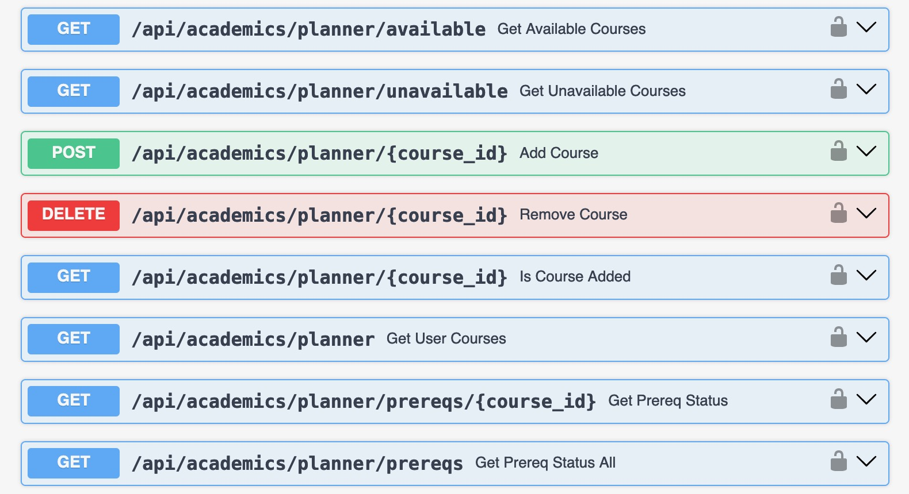

# Academics Feature Technical Specification

> Written by Ben Chesser, Asim Raja, Aristotle Bernard, and Alexandra Marum for the CSXL Web Application.  in Comp 423 _Last Updated: 5/3/2024_

This document contains the technical specifications for the Academic Planner feature of the CSXL web application. This feature adds _8_ new API routes, and _1_ new frontend components to the application.

The Academic Planner feature uses the UNC course functionality added by [Ajay Gandecha](https://github.com/ajaygandecha) including the storage of data on UNC courses, course offerings / sections for each courses, and terms. See his documentation [here](../specs/academics.md)

All visitors to the CSXL page are able to view an _academic planner_ to see all of the courses that the UNC Computer Science department offers and select courses to add to the _my courses_ section. The webpage will then calculate what other classes students can and cannot take depending on the prerequisites needed. Badges are shown on each course depending on if they are needed for the Bachelor's in Science or Arts required core classes and if they would satisfy the elective requirements for each.

The purpose of this page is very similar to the _ConnectCarolina What-If Calculator_ in that it does not officially represent the classes that students have actually taken or what classes will be open/offered in the coming semesters. Instead, it focuses on showing what a student could or could not theoretically take, and is made for planning purposes only.

## Table of Contents

- [Frontend Features](#FrontendFeatures)
  - [User Features](#UserFeatures)
    - [Academic Planner](#AcademicPlanner)
  - [Conclusion](#Conclusion)
- [Backend Design and Implementation](#BackendDesignandImplementation)
  - [Pydantic Model Implementation](#PydanticModelImplementation)
    - [Course Changes](#CourseChanges)
  - [API Implementation](#APIImplementation)
  - [Testing](#Testing)
  - [Future Considerations](#FutureConsiderations)

## Frontend Features

The frontend features add _1_ new Angular component, at the `/academics/planner/`route.

### User Features

The following pages have been added and are available for all users of the CSXL site. These pages are ultimately powered by new Angular service functions connected to new backend APIs.

#### Academic Planner

<!--This is NOT our image. We will put in our own image when we've finished implementation-->

The academic planner page serves as the central platform for students to explore potential academic pathways based on their previously completed courses. Its primary function is to experiment with potential academic pathways, rather than serving as an official record of credited courses. The page is accessible via the `/academics/planner` route. Within this section, information is presented in columns delineating taken, available, and unavailable courses. By considering prerequisites and the student's completed coursework, the page generates a list of eligible courses (the "Available Classes" column) and identifies those for which prerequisites have not yet been fulfilled (the "Unavailable Classes" column). Additionally, users have the option to filter courses based on whether they fulfill BA or BS degree requirements and contribute to major elective credits.

### Conclusion

In total, the following component has been added:

| Name                 | Route                | Description                                      |
| -------------------- | -------------------- | ------------------------------------------------ |
| **Academic Planner** | `/academics/planner` | Shows all courses, split into prereq categories. |

## Backend Design and Implementation

The academics feature ultimately adds _8_ new API routes.

### Pydantic Model Implementation

The Academic Planner uses the pre-existing Pydantic models for courses from the academics section added by [Ajay Gandecha](https://github.com/ajaygandecha). A many-to-many relationship was created between courses and users so that a user could have many courses that they add to their list and a course can be taken by many users. The models and entities were edited in the following ways:

#### Model and Entity Changes

- There were _3_ new fields added to our Course entity and Course model...

  - representing the prerequisite logic (stored as a string) that when using the Python eval() returns a boolean value.
  - representing if a course is a Bachelor's in Science or the Bachelor's in Art degree requirement.

- To the entities specifically, we added...

  - A many-to-many relationship between courses and users so that a user could have many courses that they add to their list and a course can be taken by many users.
  - This relationship was created using an association table.

### API Implementation

The Academics feature adds 8 new API routes to handle CRUD operations courses, and users.

#### Planner APIs:

### Testing

The Academic Planner feature adds full, thorough testing to every new service function added in the course, section, term, and room services. All tests pass, and all services created or modified have 100% test coverage.

## Future Considerations

- If we are able to get the data we could consider adding all courses at UNC, not just the ones most pertinent to the Computer Science majors.
  - In this case, we could add more functionality to requirements for different majors, but the fields for being BA or BS would likely need to be reworked.
  - When adding new courses, extra care needs to be taken to properly write their "prereq" fields, so that the academic planner continues to function optimally
